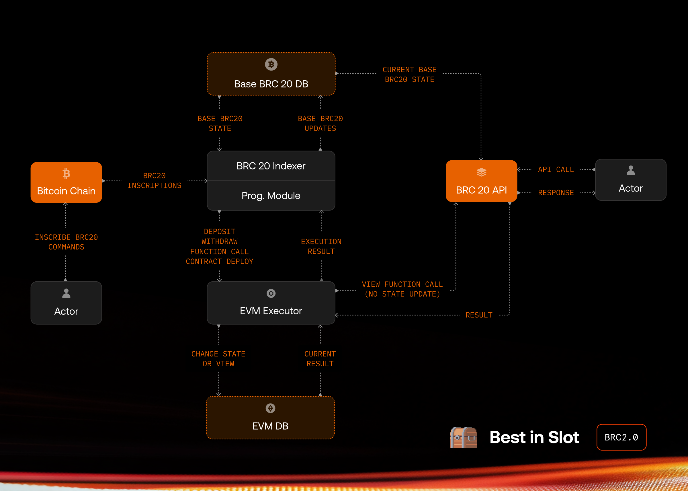

# BRC-20 - The Programmable Module

## Introduction

This BRC2.0 proposal aims to add smart contract execution capabilities, and remove UTXO bloat in the BRC-20 standard.

Below are some key aspects of how it works:

- All operations are conducted via Bitcoin on-chain Ordinals inscriptions.
- Any Bitcoin wallet can send commands to the module and interact with it permissionlessly.
- Indexers evaluate these operations using a local executor and update the Programmable Module state accordingly.

The Programmable Module is designed to function without any reliance on centralized systems, bridges, multisigs, Layer 2 solutions, sequencers, or validator networks—and maintains the following properties: 

- Users only pay for Bitcoin transactions — there are no extra fees for users or developers to interact with the Programmable Module.
- There is no "gas-token". The topic of "gas" is handled at the indexer level, primarily to prevent certain types of attacks towards indexers.
- The Programmable Module does not require any sequencers to function. That said, anyone can build an application that utilizes various sequencer technologies.

> [!WARNING]
> This module is not currently enabled on Bitcoin mainnet. Until this module is released on mainnet, deposits will burn tokens and withdrawals will be invalid.

## Execution Engine & Virtual Machine

To execute valid operations and compute the state, a virtual machine is required.

We chose `EVM` for the virtual machine and are building a custom `EVM` execution engine using [`revm`](https://github.com/bluealloy/revm). Our main reasons for choosing `EVM` are listed below:

- Rich open-source ecosystem for tooling, including several different execution engines
- Heavily tested open-source smart contract libraries that are readily available for various financial applications
- Large and active developer community - many smart contract developers are already familiar with `EVM` and `Solidity`
- `EVM` is deterministic and Turing complete.
- `EVM` has a small set of possible opcodes, all of which are heavily tested for their performance impact. Therefore, their gas-costs can be used to prevent a DoS attack on Programmable Module by setting per-transaction or per-block gas limits.

The customized `revm` execution engine only handles the VM execution part of Ethereum. It doesn't compute any other blockchain operations. There is no "block production" or any kind of PoS validation mechanism. This simplified approach allows the execution engine to be an estimated 10x more performant than it would be as part of a PoS blockchain.

The engine can set some blockchain-level variables, such as custom block hash, block height, timestamp, and coinbase (same as in Bitcoin), before executing operations.

Additionally, we've written several custom pre-compiled contracts:

- `0x00000000000000000000000000000000000000ff`: Get non-module BRC-20 balance of a given Bitcoin wallet script and BRC-20 ticker. This enables interoperability with base BRC-20 tokens.

- `0x00000000000000000000000000000000000000fe`: Check BIP-322 signature.

- `0x00000000000000000000000000000000000000fd`: Get Bitcoin transaction details using tx ids. This enables interoperability with Bitcoin and bonding curve style token minting and selling using BTC.

- `0x00000000000000000000000000000000000000fc`: Get last satoshi location given txid, vout and sat number using the rules at [ordinals/ord/blob/master/bip.mediawiki](https://github.com/ordinals/ord/blob/master/bip.mediawiki)

- `0x00000000000000000000000000000000000000fb`: Get the time lock wallet pkscript for a given p2tr pkscript and a lock duration. This works according to our proposal in [ordinals/ord/issues/4256#issuecomment-2700779238](https://github.com/ordinals/ord/issues/4256#issuecomment-2700779238)

This list can be expanded before release.

Since EVM operates with a different address format than Bitcoin, we've added an easy-to-use address translation method:

`evm_addr = keccak256(bitcoin_pkscript_bytes).slice(-40)`

This EVM address does not have a private key attached, so it cannot sign messages. For this reason, smart contract developers should avoid `ecrecover` and use the custom precompile for `BIP-322` signature check. If it succeeds, use `evm_addr` as verified user address. We'll add helper Solidity libraries for these standard use cases.

The execution engine is completely open-source and can be found at [bestinslot-xyz/brc20-programmable-module](https://github.com/bestinslot-xyz/brc20-programmable-module).

## Integration

**The execution engine is designed to be indexer agnostic.** Any custom BRC-20 indexer can easily integrate the engine into their systems, as it will work with `JSON-RPC`. Additionally, the engine can run `view` functions and return results such that indexers can track user balances by calling `balance_of` or similar functions. The engine can also generate and report EVM logs, enabling indexers to track operations.

Following image shows a high-level architecture of how the BRC20 indexer and The Programmable Module interact with each other:



[You can find the integration details here](https://github.com/bestinslot-xyz/brc20-programmable-module?tab=readme-ov-file#indexer-integration-guide)

## Operations

### Deposit & Withdraw

Deposit and withdraw operations follow the [BRC20 deposit & withdraw rules defined here](https://github.com/brc20-devs/brc20-proposals/blob/main/bp01-module/proposal.md#operations).

An example deposit would look like the following

```json
{
  "p": "brc-20",
  "op": "transfer",
  "tick": "ordi",
  "amt": "10"
}
```

Main difference is there can only be one programmable module, so the deposit address is selected as `OP_RETURN "BRC20PROG"`.

An example withdraw would look like the following

```json
{
  "p": "brc20-module",
  "op": "withdraw",
  "tick": "ordi",
  "amt": "10",
  "module": "BRC20PROG"
}
```

The `module` field in the withdraw operation is selected as `BRC20PROG`. A withdrawal is processed when this inscription is sent to the target address.

There is a pre-deployed `BRC20Controller` smart contract at a fixed address in the EVM. Its deposit and withdraw functions are not publicly callable and can only be used by the indexer. This contract is also ERC-20 compatible, so users can transfer their balances to any other address or smart contract with ERC-20 transfer operations using this contract.

At a valid deposit event, the indexer calls the deposit function for the depositor wallet and after this point, the depositor can control the balance with smart contract calls.

At a valid withdraw event, indexer calls the withdraw function for withdrawer and if the
`BRC20Controller` has enough balance for withdrawer, the withdrawal will succeed. Otherwise, it will be invalid.

### Deploy Smart Contract

Deploying a smart contract will be the most costly operation due to the size of smart contracts. Therefore, we minimized the costs by not including the source code and ABI in the deployment inscription and just put the final data that is needed for the EVM executor.

An example smart contract deployment would look like the following:

```json
{
    "p": "brc20-prog",
    "op": "d",
    "d": "<0x prefixed hex string bytecode + constructor args>",
    "b": "<base64 encoded bytecode + constructor args, format explained below>"
}
```

#### Fields

- **p**: Name of the `brc20-prog` module
- **op**: This can be "deploy", or "d" for short, for contract deployment inscriptions
- **b**: Deployment transaction for the smart contract with its constructor arguments, pre-packed by the caller, compressed and base64 encoded. [Format explained below](#data-format-and-compression-support).
- **d**: Alternative to "b" field, deployment transaction for the smart contract with its constructor arguments, pre-packed by the caller, as a 0x prefixed hex string.

To activate a smart contract deployment, the inscription should be sent to `OP_RETURN "BRC20PROG"` directly after being inscribed (in its second transaction).

When an indexer indexes this inscription, an `EVM address` will be generated from the `btc pkscript` of the wallet that sent the inscription to the module. 

At this point, the Executor will execute this operation with the same rules as `EVM`, and if the execution is successful, a new smart contract will be deployed to the state of the Executor.

### Function Call

We propose the following structure to inscribe a function call:

```json
{
    "p": "brc20-prog",
    "op": "c",
    "c": "<contract_addr>",
    "i": "<inscription_id>",
    "d": "<0x prefixed hex string calldata>",
    "b": "<base64 encoded calldata, format explained below>"
}
```

#### Fields

- **p**: Name of the `brc20-prog` module
- **op**: This can be "call", or "c" for short, for call inscriptions
- **c**: Contract Address
- **i**: Inscription ID for the Contract Deployment
- **b**: Arguments for the calldata, pre-packed by the caller, compressed and base64 encoded. [Format explained below](#data-format-and-compression-support).
- **d**: Arguments for the calldata, alternatively, pre-packed by the caller, using raw 0x prefixed hex string.

> [!WARNING]
> Only one of "c" or "i" fields should be inscribed, as the contract to call can be ambiguous.

> [!WARNING]
> Only one of "b" or "d" fields should be inscribed, so the data should be either base64 encoded or represented as a 0x prefixed hex string.

To activate the function call, this inscription should be sent to `OP_RETURN "BRC20PROG"` directly after being inscribed (in its second transaction).

### Signed ETH transactions

Inscribed pre-signed transactions are also accepted by BRC2.0 to interact directly with the EVM. These signed transactions should follow the EIP-155 format with the correct chain ID and nonce values.

We propose the following structure to inscribe a pre-signed raw ETH transaction:

```json
{
    "p": "brc20-prog",
    "op": "t",
    "d": "<0x prefixed hex string for signed transaction>",
    "b": "<base64 encoded calldata for the signed transaction, format explained below>"
}
```

#### Fields

- **p**: Name of the `brc20-prog` module
- **op**: This can be "transact", or "t" for short, for raw transaction inscriptions
- **b**: Pre-signed ETH transaction, compressed and base64 encoded. [Format explained below](#data-format-and-compression-support).
- **d**: Pre-signed ETH transaction, alternatively, using raw 0x prefixed hex string.

> [!WARNING]
> Only one of "b" or "d" fields should be inscribed, so the transaction should be either base64 encoded or represented as a 0x prefixed hex string.

To send the raw transaction, this inscription should be sent to `OP_RETURN "BRC20PROG"` directly after being inscribed (in its second transaction).

### Data Format and Compression Support

`"d"` or `"b"` field in deploy and call inscriptions is used to communicate with the underlying EVM.

If using `"d"` field, data is always sent uncompressed, and hex encoded with a 0x prefix e.g. `0x1234567..EF`.

Calldata may contain repetitions and often zero-heavy, so it's suitable for compression. Compressing and encoding the inscription data helps us reduce the on-chain costs.

If using `"b"` field, data is sent as a base64 encoded byte array to make it JSON-safe and compact. The first byte of the decoded payload now defines the compression method used:

- `00`: Uncompressed byte array
- `01`: NADA compression — our custom zero-run-length encoding, optimized for data with large spans of zeroes. Libraries available in [Rust](https://crates.io/crates/nada) and [JavaScript](https://www.npmjs.com/@bestinslot/nada) and the code is available in our [bestinslot-xyz/nada-rs](https://github.com/bestinslot-xyz/nada-rs) and [bestinslot-xyz/nada-js](https://github.com/bestinslot-xyz/nada-js).
- `02`: Zstandard (zstd) — widely adopted compression algorithm developed by Meta. Standard libraries available on [facebook/zstd](https://github.com/facebook/zstd).

Bytecode and calldata needs to be prefixed with a single-byte compression prefix, and then base64 encoded.

#### Example

Calling a method with signature `transfer(address receiver, bytes ticker, uint256 amount)` with following parameters:

- receiver: `0xdead09C7d1621C9D49EdD5c070933b500ac5beef`
- ticker: `ordi` as byte array [6f, 72, 64, 69]
- amount: 42

Generates the following abi encoded calldata:

<code>0xa23ccb13000000000000000000000000dead09c7d1621c9d49edd5c070933b500ac5beef0000000000000000000000000000000000000000000000000000000000000060000000000000000000000000000000000000000000000000000000000000002a00000000000000000000000000000000000000000000000000000000000000046f72646900000000000000000000000000000000000000000000000000000000</code>

Original length for the calldata is 164 bytes (330 characters).

When the original calldata is nada encoded, length reduces to 41 bytes (84 characters):

<code>0xa23ccb13ff0cdead09c7d1621c9d49edd5c070933b500ac5beefff1f60ff1f2aff1f046f726469ff1c</code>

When the original calldata is zstd compressed (with compression level 22), length reduces to 58 bytes (118 characters):

<code>0x28b52ffd20a48d01004402a23ccb1300dead09c7d1621c9d49edd5c070933b500ac5beef0060002a00046f726469000510006111b1880b166b01</code>

In this case, we choose the nada encoded one, as it's the shortest, and prepend a 0x01 at the start to indicate this data is nada encoded:

<code>0x<b>01</b>a23ccb13ff0cdead09c7d1621c9d49edd5c070933b500ac5beefff1f60ff1f2aff1f046f726469ff1c</code>

We then base64 encode the byte array to produce the final inscription data of 56 characters:

<code>AaI8yxP/DN6tCcfRYhydSe3VwHCTO1AKxb7v/x9g/x8q/x8Eb3Jkaf8c</code>

### Gas Usage and Limit

Users only pay for Bitcoin transactions, to inscribe data on-chain. There is no additional "gas-token" to interact with BRC2.0, and the topic of "gas" is handled at the indexer level, primarily to prevent certain types of attacks towards indexers.

We currently set a 12000 per-byte gas limit for each operation, which means an inscription that is 100 bytes in length is only allowed 1200000 gas to run. This way, we limit the maximum possible gas used in a single block as well. Currently, blocks have a 4MB size limit, so the amount of maximum gas per block corresponds to roughly 50B gas.

Gas estimation can be retrieved before calling a function, and the inscription can be padded with extra spaces within the JSON object to increase the byte size. This will allow indexers to adjust the gas usage per inscription.

## Attack Vectors & Prevention

### Denial-of-Service Attacks

Since we are using EVM (with a different block time and a different data layer), we can easily use the DoS prevention methods that are used in other EVM chains. The easiest way to limit the maximum needed execution in a block is to set a block gas limit.

We currently set a 12000 per-byte gas limit for each operation, which means an inscription that is 100 bytes in length is only allowed 1200000 gas to run. This way, we limit the maximum possible gas used in a single block as well. Currently, blocks have a 4MB size limit, so the amount of maximum gas per block corresponds to roughly 50B gas.

If a user wants to run an operation with more gas, they can pad spaces to the inscription to increase the allowed gas limit. This approach imposes a cost on potential DoS attacks, forcing attackers to fill several blocks to meaningfully impact indexing. Additionally, the cost of an attack will increase incrementally due to the open-market structure of the Bitcoin fee market.

### Zip Bomb Attacks

With compression support, attackers can impact indexing by potentially uploading huge calldata and bytecode. We're mitigating this by limiting the size of the uncompressed calldata to a 1MB buffer. Nada supports this via `nada::decode_with_limit` method and zstd libraries support this by returning an error if the buffer is full.

Calldata, even with a full buffer of 1MB, is subject to the gas limits of the inscription byte length, so it can't keep the EVM occupied.

### Other Attacks

We will expand this section as we and/or other developers in the community discover new attack vectors.

## Indexing Rules

Indexing rules are detailed in [Programmable Module Indexer Integration guide](https://github.com/bestinslot-xyz/brc20-programmable-module#indexer-integration-guide)

## Changelog

### 17 Jun 2025
- Added pre-signed transaction inscriptions to the proposal

### 12 Jun 2025
- Added compression and base64 encoding support using the "b" field of the inscription
- Removed note for compression activation block height, as it's no longer a requirement

### 20 May 2025
- Added a github link for the execution engine
- Introduced a section on calldata compression (nada, zstd)
- Added a calldata encoding example (abi, nada, zstd, base64)
- Added zip bomb mitigation strategy (1MB decode buffer)
- Expanded "d" field docs for deploy/call operations
- Noted compression activation block height (placeholder)
- Added a gas limit section, explaining the 12k gas per inscribed byte limit
