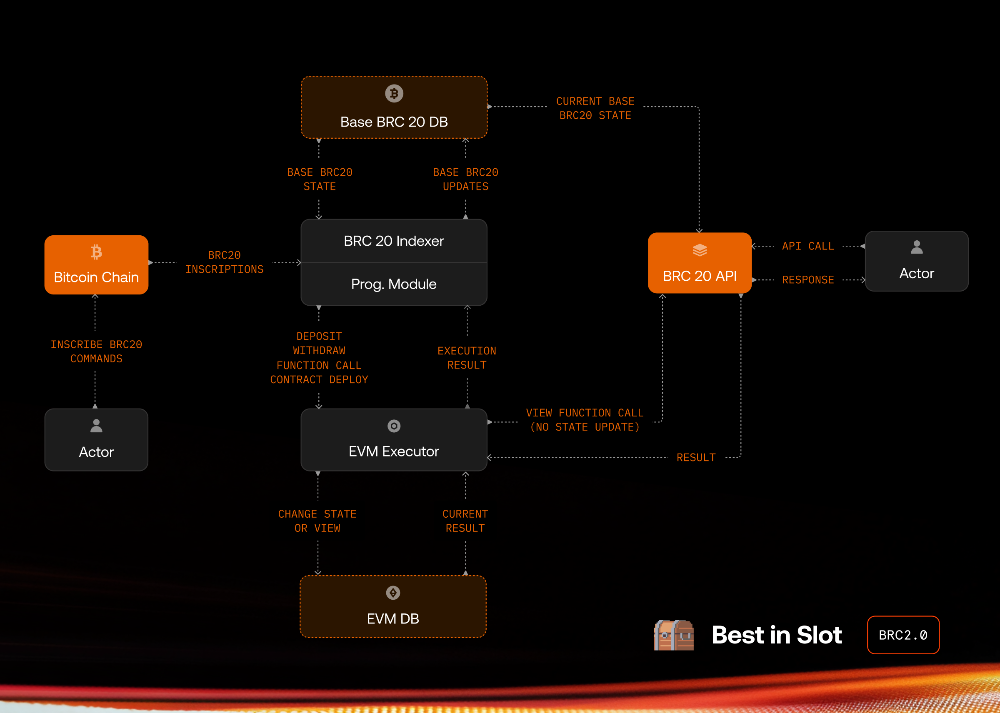

# BRC-20 - The Programmable Module
## Introduction

This BRC2.0 proposal aims to add smart contract execution capabilities, and remove UTXO bloat in the BRC-20 standard.

Below are some key aspects of how it works:

- All operations are conducted via Bitcoin on-chain Ordinals inscriptions.
- Any Bitcoin wallet can send commands to the module and interact with it permissionlessly.
- Indexers evaluate these operations using a local executor and update the Programmable Module state accordingly.

The Programmable Module is designed to function without any reliance on centralized systems, bridges, multisigs, Layer 2 solutions, sequencers, or validator networks—and maintains the following properties: 

- Users only pay for Bitcoin transactions — there are no extra fees for users or developers to interact with the Programmable Module.
- There is no "gas-token". The topic of "gas" is handled at the indexer level, primarily to prevent certain types of attacks towards indexers.
- The Programmable Module does not require any sequencers to function. That said, anyone can build an application that utilizes various sequencer technologies.

> [!WARNING]
> This module is not currently enabled on Bitcoin mainnet. Until this module is released on mainnet, deposits will burn tokens and withdrawals will be invalid.

## Execution Engine & Virtual Machine

To execute valid operations and compute the state, a virtual machine is required.

We chose `EVM` for the virtual machine and are building a custom `EVM` execution engine using [`revm`](https://github.com/bluealloy/revm). Our main reasons for choosing `EVM` are listed below:

- Rich open-source ecosystem for tooling, including several different execution engines
- Heavily tested open-source smart contract libraries that are readily available for various financial applications
- Large and active developer community - many smart contract developers are already familiar with `EVM` and `Solidity`
- `EVM` is deterministic and Turing complete.
- `EVM` has a small set of possible opcodes, all of which are heavily tested for their performance impact. Therefore, their gas-costs can be used to prevent a DoS attack on Programmable Module by setting per-transaction or per-block gas limits.

The customized `revm` execution engine only handles the VM execution part of Ethereum. It doesn't compute any other blockchain operations. There is no "block production" or any kind of PoS validation mechanism. This simplified approach allows the execution engine to be an estimated 10x more performant than it would be as part of a PoS blockchain.

The engine can set some blockchain-level variables, such as custom block-hash, block- height, timestamp, and coinbase (same as in Bitcoin), before executing operations.

Additionally, we've written several custom pre-compiled contracts:

- `0x00000000000000000000000000000000000000ff`: Get non-module BRC-20 balance of a given Bitcoin wallet script and BRC-20 ticker. This enables interoperability with base BRC-20 tokens.

- `0x00000000000000000000000000000000000000fe`: Check BIP-322 signature.

- `0x00000000000000000000000000000000000000fd`: Get Bitcoin transaction details using tx ids. This enables interoperability with Bitcoin and bonding curve style token minting and selling using BTC.

This list can be expanded before release.

Since EVM operates with a different address format than Bitcoin, we've added an easy-to-use address translation method:

`evm_addr = keccak256(bitcoin_pkscript).slice(-40)`

This EVM address does not have a private key attached, so it cannot sign messages. For this reason, smart contract developers should avoid `ecrecover` and use the custom precompile for `BIP-322` signature check. If it succeeds, use `evm_addr` as verified user address. We'll add helper Solidity libraries for these standard use cases.

The execution engine will be completely open-source and is currently a work in progress.

## Integration

**The execution engine is designed to be indexer agnostic.** Any custom BRC-20 indexer can easily integrate the engine into their systems, as it will work with `JSON-RPC`. Additionally, the engine can run `view` functions and return results such that indexers can track user balances by calling `balance_of` or similar functions. The engine can also generate and report EVM logs, enabling indexers to track operations.

Following image shows a high-level architecture of how the BRC20 indexer and The Programmable Module interact with each other:



> [!NOTE]
> Integration details will be published after the `JSON-RPC` protocol details are finalized.

## Operations

### Deposit & Withdraw

Deposit and withdraw operations follow the [BRC20 deposit & withdraw rules defined here](https://github.com/brc20-devs/brc20-proposals/blob/main/bp01-module/proposal.md#operations).

An example deposit would look like the following

```json
{
  "p": "brc-20",
  "op": "transfer",
  "tick": "ordi",
  "amt": "10"
}
```

Main difference is there can only be one programmable module, so the deposit address is selected as `OP_RETURN "BRC20PROG"`.

An example withdraw would look like the following

```json
{
  "p": "brc20-module",
  "op": "withdraw",
  "tick": "ordi",
  "amt": "10",
  "module": "BRC20PROG"
}
```

The `module` field in the withdraw operation is selected as `BRC20PROG`. A withdrawal is processed when this inscription is sent to the target address.

There is a pre-deployed `BRC20Controller` smart contract at a fixed address in the EVM. Its deposit and withdraw functions are not publicly callable and can only be used by the indexer. This contract is also ERC-20 compatible, so users can transfer their balances to any other address or smart contract with ERC-20 transfer operations using this contract.

At a valid deposit event, the indexer calls the deposit function for the depositor wallet and after this point, the depositor can control the balance with smart contract calls.

At a valid withdraw event, indexer calls the withdraw function for withdrawer and if the
`BRC20Controller` has enough balance for withdrawer, the withdrawal will succeed. Otherwise, it will be invalid.

### Deploy Smart Contract

Deploying a smart contract will be the most costly operation due to the size of smart contracts. Therefore, we minimized the costs by not including the source code and ABI in the deployment inscription and just put the final data that is needed for the EVM executor.

An example smart contract deployment would look like the following:

```json
{
    "p": "brc20-prog",
    "op": "deploy",
    "d": "<bytecode + constructor_args in hex>"
}
```

To activate a smart contract deployment, the inscription should be sent to `OP_RETURN "BRC20PROG"` directly after being inscribed (in its second transaction).

When an indexer indexes this inscription, an `EVM address` will be generated from the `btc pkscript` of the wallet that sent the inscription to the module. 

At this point, the Executor will execute this operation with the same rules as `EVM`, and if the execution is successful, a new smart contract will be deployed to the state of the Executor. 

> [!NOTE]
> The indexer should save the `inscription_id` and `smart_contract_address` pair since the `function call` operation can point to either address or inscription_id.

### Function Call

We propose the following to inscribe a function call:

```json
{
    "p": "brc20-prog",
    "op": "call",
    "c": "<contract_addr>",
    "i": "<inscription_id>", // only one of c or i can be inscribed.
    "d": "<data>" // arguments are pre-packed into data by the caller.
}
```

To activate the function call, this inscription should be sent to `OP_RETURN "BRC20PROG"` directly after being inscribed (in its second transaction).

Since data may contain several repetitions, we intend to add future support for compression on the data field.

## Attack Vectors & Prevention

### Denial-of-Service Attacks

Since we are using EVM (with a different block time and a different data layer), we can easily use the DoS prevention methods that are used in other EVM chains. The easiest way to limit the maximum needed execution in a block is to set a block gas limit.

The details of how the gas limit will work have not been finalized. We're considering  setting a per-byte gas limit for each operation. This way, we can limit the maximum possible gas used in a single block.

Additionally, if a user wants to run an operation with more gas, they can pad spaces to the inscription to increase the allowed gas limit. This approach imposes a cost on potential DoS attacks, forcing attackers to fill several blocks to meaningfully impact indexing. Additionally, the cost of an attack will increase incrementally due to the open-market structure of the Bitcoin fee market.

### Other Attacks

We will expand this section as we and/or other developers in the community discover new attack vectors.

## Indexing Rules

TBD after the protocol details are finalized.
